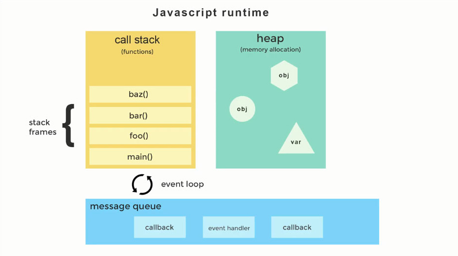

# Async Foundations (JS Runtime and Event Loop)

Javascript is a:
- synchronous
- blocking and
- single-threaded
  language

That means Javascript can perform only a single task at any given time. Only one function can run at a time and untill it returns, everything else in the program is blocked.

**For example:**
If you accidentally coded an infinite loop or an infinitely recursive function or encountered a stack overflow, your browser locks up, freezes down and becomes unresponsive. At this time, the browser can't render or run any other code. This happens because of the blocking nature of synchronous code.

So it's really important for JS programmers to be aware of Javascript's single threaded nature and know how to write non-blocking code.

But, how do we achieve the asynchronous behavior in JS being it a single-threaded language?  
Through **Callbacks, Promises and Async/Await**. (But we'll discuss these in the next sections)

First, we need to take a closer look at some of the Javascript Basics

## Javascript Runtime
- Javascript runtime refers to where your javascript code is executed when you run it. 
- Each browser has a JS Runtime Environment. In the environment are Web API’s that a developer can access to build a program.
- Also in the runtime environment is a *Javascript Engine* that parses the code. Each browser has its own version of a JS engine. Chrome uses what it calls its *V8 JS Engine*

> JavaScript has a concurrency model based on an event loop, which is responsible for executing the code, collecting and processing events, and executing queued sub-tasks. 



The Javascript Runtime has the following components:
1. The Heap
2. The Stack
3. The Web API Container (which we'll discuss later)
4. The Message Queue(or the Callback Queue) and
5. The Event Loop

### The Heap
- Its an unstructured region of memory where objects and variables are stored.

### The Stack
- its an ordered data structure that runs LIFO - Last In First Out i.e. it is always processed from top to bottom
- keeps track of function invocations
- part of the JS runtime (you can't access it directly)

#### How Your Code Changes the Stack? 
- Whenever we invoke a function, the details of the invocation are saved to the top of the stack (**pushed** to the top).
- Whenever a function returns, the information about the invocation is taken off the top of the stack (**popped** off from the top).

- As the interpreter parses through the JS source file, it creates a **'stack frame'** for each function that it encounters.
- It then places the stack frame on LIFO data structure called a stack where the function execution is recorded.
- When one function calls another, a new stack frame is placed on top of it. This process continues until the innermost function returns at which time the stack frame is popped off the stack.
- You can think of the **call stack** as the **single thread of execution** in Javascript.

### The Message Queue
- The Message Queue will store all the messages in the order in which they were added.
- Each message is associated with a function such as a callback or an event.
- It waits to be processed until the Stack is completely empty. 

> The **Queue** is a data structure that runs FIFO — first in first out. Whereas the Stack uses a push and pop (add to end take from end), the Queue uses push and shift (add to end take from beginning).

### The Event Loop
- The event loop's job is to continually watch both the **Stack** and the **Message Queue**.
- When the stack becomes empty it checks the Message Queue to see if there are any messages waiting to be processed.
- If so, it sends the message(callback function) at the beginning of the queue to the Stack.
- When the Stack is clear again, it will send over its next callback function and executes them one after the other.

---------------------------------------------------------------------------------------------------------------------------------------

Now the thing is, JS Runtime can only do one thing at a time. It can't make an AJAX request while you're doing other code or it can't do a setTimeout() while you're doing other code.  
So, then how do we achieve asynchronous behaviour?

The answer is the **Web API's**

### The Web API's
- JS Runtime can only do one thing at a time, but the browser gives us other things called the **Web API's**.
- These API's are effectively threads that you can make calls to.
- The JS Runtime is augmented by a set of API's that handle asynchronous behaviour.
- If you use Node, the you have C++ API's instead of Web API's.

> These things are not a part of core JS, but built on top of it and supplementary in nature.

A list of Web API(or Browser API) calls includes: 
- setTimeout()
- DOM Events
- geolocation
- XMLHTTPRequest objects (used for making AJAX calls )

The Web API calls that are sent to the Web API container from the Stack, like event listeners, HTTP/AJAX requests, or timing functions, sit there until an action is triggered. Either a ‘click’ happens, or the HTTP request finishes getting its data from its source, or a timer reaches its set time. In each instance, once an action is triggered, a ‘callback function’ is sent to the fourth and final container, the ‘callback queue.’


1. When the JS Runtime encounters an asynchronous function in the call stack, it immediately returns via an implicit return.
2. The asynchronous process continues in the Browser/Web API.
3. The callback is registered in an event table and then subsequently added to the message queue when the operation is completed.
4. Once the call stack is empty, then the **Event Loop** will grab that callback out of the message queue and add it to the call stack to run it.

---------------------------------------------------------------------------------------------------------------------------------------
So, here is a running example of JS asynchronous code in the JS Runtime and the Web API


- Another common use case of asynchronous JS is when we use setTimeout to zero.
- That doesn't mean that the code will run immediately(because its zero seconds).
- We set the timeout to zero when we want to defer something until the stack is clear.
```javascript
console.log('Hi');
setTimeout( function cb(){
	console.log('there');
}, 0);
console.log('JSConfEU');
```

#### Single Threaded Example
```javascript
setTimeout( function (){
	console.log('hello from the timeout');
}, 0);
for(var i = 0; i < 1000000000; i++) {
	var x = i * 2;
}
console.log('Done with the loop');
```
- The callback function will only run after the loop has finished execution.
